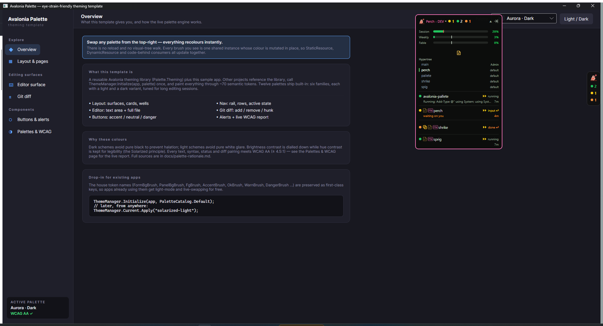
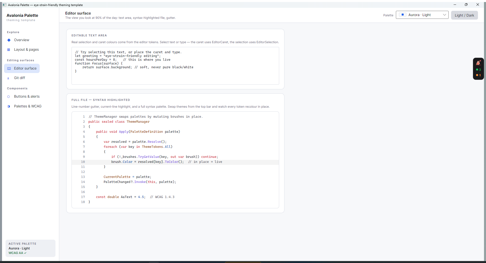
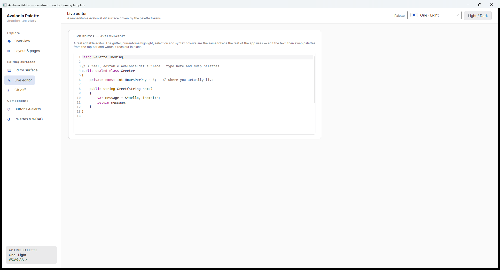
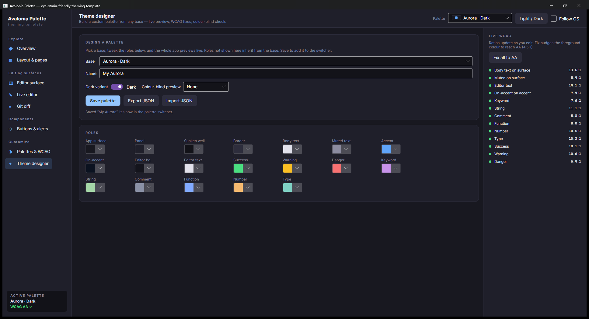

# Avalonia Palette

A **template repository** for building Avalonia desktop apps with good-looking, user-swappable
colour palettes that are **kind to the eyes over a full working day** and hold to **WCAG AA**.

It ships:

- **`Palette.Theming`** — a small, reusable theming library: ~70 semantic colour tokens, a live
  `ThemeManager` that swaps palettes at runtime, WCAG contrast utilities (incl. an auto-fix),
  colour-blindness simulation, follow-the-OS light/dark, optional per-user persistence,
  user-defined **custom palettes** (JSON), and **18 built-in palettes** (nine families × light + dark).
- **`Palette.Sample`** — a runnable demo app: swap every palette in real time, a live WCAG report,
  a syntax-highlighted file view, a git diff, a genuinely editable **AvaloniaEdit** surface, and a
  **theme designer** to build & save your own palette — all driven by the same tokens.

Other projects reference `Palette.Theming`, call one line at startup, and paint everything through
the tokens. Existing apps that already use the house token names (`FormBgBrush`, `AccentBrush`,
`OkBrush`, …) get **light mode and live swapping for free**.

| Aurora · Dark (overview) | Aurora · Light (editor surface) |
|---|---|
|  |  |

> Both shots are the **same app**; the second is one click on *Light / Dark*. Nothing reloaded —
> the brushes recolour in place.

The **Live editor** page is a real, editable [AvaloniaEdit](https://github.com/AvaloniaUI/AvaloniaEdit)
surface driven by the same tokens (here in *One · Light*, restored from the saved preference):



---

## Why this exists

Editing surfaces are where a developer spends ~90% of the day, so the defaults matter:

- **No pure black, no pure white.** `#000`/`#fff` pairings hit 21:1 and cause halation and glare;
  softened near-black surfaces with off-white text stay comfortable and still clear AAA.
- **Low brightness-contrast, high hue-contrast** — the Solarized principle — so syntax stays
  legible without the page "buzzing".
- **WCAG AA on everything that carries meaning** — body text, syntax, status and diff colours all
  meet ≥ 4.5:1. A headless gate (`--verify`) proves it and can run in CI.

The reasoning and full source list is in [`docs/palette-rationale.md`](docs/palette-rationale.md).

---

## Quick start

```bash
run.bat                 # Windows: build + run the demo
run.bat --verify        # Windows: headless WCAG gate

# or directly:
dotnet run --project src/Palette.Sample            # run the demo
dotnet run --project src/Palette.Sample -- --verify # prove every palette meets WCAG AA (exit 1 if not)
```

Requires the .NET 10 SDK. Avalonia **12.0.5**, `CommunityToolkit.Mvvm`, `Avalonia.AvaloniaEdit`.
The demo remembers the last palette you picked (stored under `%APPDATA%/AvaloniaPalette.Sample`).

### Install it in your app

`Palette.Theming` is a normal NuGet package. Build it and add it as a dependency:

```bash
dotnet pack src/Palette.Theming -c Release -o artifacts        # produces the .nupkg
dotnet add package ArcticGizmo.Avalonia.Palette                # in your app
```

> Package id: `ArcticGizmo.Avalonia.Palette` · assembly/namespace: `Palette.Theming`.

Local feeds, GitHub Packages and nuget.org are all covered in
[`docs/publishing.md`](docs/publishing.md). Prefer no package? Reference the project directly:
`<ProjectReference Include="..\avalonia-pallete\src\Palette.Theming\Palette.Theming.csproj" />`.

### Wire it up (three steps)

```csharp
// 1) at startup, after FluentTheme is in Application.Styles:
public override void OnFrameworkInitializationCompleted()
{
    ThemeManager.Initialize(this, PaletteCatalog.Default);   // registers all brushes
    // ... set MainWindow ...
}
```

```xml
<!-- 2) paint with the tokens (DynamicResource recommended) -->
<Border Background="{DynamicResource PanelBgBrush}"
        BorderBrush="{DynamicResource BorderBrush}">
    <TextBlock Text="Hello" Foreground="{DynamicResource FgBrush}"/>
</Border>
```

```csharp
// 3) swap any time, from anywhere — every surface recolours instantly:
ThemeManager.Current.Apply("solarized-light");
```

Copy `src/Palette.Sample/Styles/Controls.axaml` into your app for ready-made button / alert /
panel / editor styles, or cherry-pick from it. Full integration notes:
[`docs/theming-guide.md`](docs/theming-guide.md).

---

## For AI agents

Working in a repo that uses this package? Point your agent at
[`AGENTS.md`](AGENTS.md) — imperative usage rules in the cross-tool
[agents.md](https://agents.md) convention. It's also bundled in the NuGet package under
`docs/AGENTS.md`, and every public type carries XML doc comments (so IntelliSense-driven agents get
the API surface without any extra setup). The load-bearing rule: **swap via
`ThemeManager.Current.Apply(...)`; never replace the brush instances in `Application.Resources`.**

## The palettes

Each family has a **Light** and a **Dark** variant. All pass WCAG AA on text/syntax/status/diff.

| Family | Character | Best for |
|---|---|---|
| **Aurora** | The house scheme — indigo surfaces, sky-blue accent | General day-to-day |
| **Solarized** | Ethan Schoonover's low-brightness-contrast classic | Very long sessions |
| **Nord** | Desaturated arctic blue-grey | Calm, low colour-clash |
| **Gruvbox** | Warm retro, reduced blue light | Evening / low-light rooms |
| **One** | Atom's balanced neutral slate | Broad syntax work |
| **Tokyo Night** | Deep indigo, saturated but low-glare | Focused night coding |
| **Rosé Pine** | Soft rose-and-pine, low contrast | Relaxed, aesthetic |
| **Sepia** | Paper-warm, minimal blue | Night work, reading-heavy |
| **High Contrast** | AAA-targeted, maximum legibility | Accessibility needs, glare |

Colour theory and per-family sources: [`docs/palette-rationale.md`](docs/palette-rationale.md).
The complete token list: [`docs/token-reference.md`](docs/token-reference.md).

---

## Design your own

The **Theme designer** page builds a custom palette from any base: tweak the key colour roles with
pickers and the whole app previews live, check contrast as you go (with one-click **Fix** to reach
AA), preview it under colour-blindness, then **Save** — it joins the switcher and persists. Export
/ import is plain JSON.



Because the engine applies *any* `PaletteDefinition`, custom themes are first-class. From code:

```csharp
var mine = PaletteCatalog.AuroraDark with { Accent = Rgb.FromHex("#FF7A00") };
ThemeManager.Current.Apply(mine);                       // recolours live
new CustomPaletteStore("MyApp").SavePalette(mine);      // persist + add to the switcher
```

Other extras: `ThemeManager.Current.FollowOsTheme(true)` tracks the system light/dark setting;
`ThemeManager.Current.SetCvd(Cvd.Deuteranopia)` previews the whole app under colour-vision
deficiency; `Contrast.AdjustToMeet(fg, bg)` nudges a colour until it passes AA.

## How it works (the one clever bit)

`ThemeManager` keeps **one `SolidColorBrush` instance per token** in `Application.Resources`.
Applying a palette **mutates each brush's `.Color` in place** instead of replacing the instance.
Avalonia controls observe brush property changes, so every consumer recolours — whether it
resolved the brush via `{StaticResource}`, `{DynamicResource}`, or a direct code reference. No
visual-tree walk, no reload. This is why the sample's XAML pages *and* its code-built editor
surface both update on the same click.

---

## Layout

```
Palette.slnx
src/
  Palette.Theming/         # the reusable library (reference this)
    Color/                 #   Rgb, Contrast (WCAG), RgbExtensions
    ThemeTokens.cs         #   the ~70-key token contract
    PaletteDefinition.cs   #   a palette's seed roles + derivation
    PaletteCatalog.cs      #   the 18 built-in palettes
    PaletteRegistry.cs     #   built-ins + custom palettes (runtime set)
    PaletteCodec.cs        #   palette <-> JSON
    CustomPaletteStore.cs  #   persist user palettes
    ThemeManager.cs        #   live swap engine (+ CVD filter, OS-follow)
    ContrastReport.cs      #   WCAG report model
    ThemePreferences.cs    #   optional per-user persistence
  Palette.Sample/          # the demo app
    Styles/Controls.axaml  #   shared, copy-pasteable control styles
    Controls/              #   CodeRenderer (file/diff), TokenColorizer (AvaloniaEdit)
    Views/ ViewModels/
run.bat                    # Windows launcher
docs/                      # rationale, token reference, integration guide
captures/                  # screenshots
```

## License

Do whatever you like with it — it's a template.
